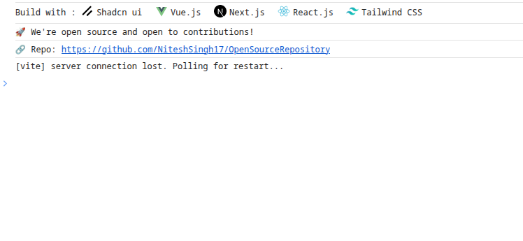

# OpenSourceRepository 🚀

A simple utility to let developers know your project is open source and highlight the frameworks/technologies used in your project with beautiful icons.



## Features

- 🎨 Display frameworks/technologies used with their icons
- 🔗 Show repository link
- 📢 Customizable open source message
- ⚙️ Highly configurable options

## Installation

```bash
npm install opensourcerepository
# or
yarn add opensourcerepository
```

## Usage

Basic usage:

```typescript
import { OpenSource } from 'opensourcerepository';
import * as packageJSON from '../package.json';

// Initialize with package.json
OpenSource({ package: packageJSON });
```

Advanced usage with custom options:

```typescript
import * as packageJSON from '../package.json';

OpenSource({
  package: packageJSON,
  showMessage: true,
  showPackages: true,
  message: "✨ Contributions are welcome!",
  repoLink: "https://github.com/yourusername/yourrepo",
  buildWith: [
    // Optional: Override detected frameworks
    { name: "TypeScript", icon: "..." },
    { name: "React", icon: "..." }
  ]
});
```

### Options

| Option | Type | Default | Description |
|--------|------|---------|-------------|
| `package` | `Record<string, any>` | Required | Your project's package.json |
| `showMessage` | `boolean` | `true` | Show open source message |
| `showPackages` | `boolean` | `true` | Show frameworks used |
| `message` | `string` | "🚀 We're open source and open to contributions!" | Custom message |
| `repoLink` | `string` | Auto-detected | Repository URL |
| `buildWith` | `Array` | Auto-detected | Override detected frameworks |

## Contributing

Contributions are always welcome! Here's how you can contribute:

1. Fork the repository
2. Create a new branch (`git checkout -b feature/amazing-feature`)
3. Make your changes
4. Commit your changes (`git commit -m 'Add some amazing feature'`)
5. Push to the branch (`git push origin feature/amazing-feature`)
6. Open a Pull Request

### Development

1. Clone the repository
2. Install dependencies:
```bash
yarn install
# or
npm install
```

3. Start development:
```bash
yarn dev
# or
npm run dev
```

## License

MIT

## Support

If you like this project, please give it a ⭐️!
